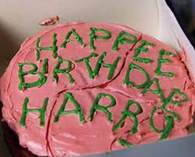

# Harry Postre y el Pastel Currificado
 
*“Un momento más tarde aparecieron los postres. Trozos de helados de todos los gustos que uno pudiera imaginar; tortas de manzana, tartas de melaza, bombitas de chocolate y pasteles con dulce, frutillas, bizcochos borrachos con fruta y crema, arroz con leche....”*

El reconocido mago de la cicatriz, viendo que su trabajo como Auror se tornó francamente aburrido
luego de derrotar a Riddle, decidió poner un local de comidas especializado en preparaciones dulces.

## 1. Postres

En el universo local de Harry Postre, para hacer postres se utilizan hechizos que se van usando sobre
los mismos para irlos preparando.

A) 
Modelar los postres. Un mismo postre puede tener muchos sabores, tiene un peso y se sirve a
cierta temperatura.
Por ejemplo, un bizcocho borracho de fruta y crema de 100 gramos servido a 25°C.

B) 
Modelar los hechizos, sabiendo que deberían poderse agregar más sin modificar el código
existente. Por ahora existen los siguientes:
    
- **Incendio**: calienta el postre 1 grado y lo hace perder 5% de su peso.
- **Immobulus**: congela el postre, llevando su temperatura a 0.
- **Wingardium Leviosa**: levanta el postre en el aire y lo deja caer, lo que agrega a sus sabores el sabor “concentrado”. Además, pierde 10% de su peso.
- **Diffindo**: Corta el postre, disminuyendo su peso en el porcentaje indicado.
- **Riddikulus**: Requiere como información adicional un sabor y lo agrega a los sabores que tiene un postre, pero invertido.
- **Avada kedavra**: Hace lo mismo que el immobulus pero además hace que el postre pierda todos sus sabores.

C) 
Dado un conjunto de postres en la mesa, saber si hacerles un determinado hechizo los dejará
listos (un postre está listo cuando pesa algo más que cero, tiene algún sabor y además no está
congelado).

*Por ejemplo, si en la mesa está el bizcocho mencionado anteriormente y una tarta de melaza de 0 grados y 50 gramos, y les hago el hechizo incendio, quedan listos, pero si les hago el hechizo riddikulus con el sabor “nomil” no, porque la tarta sigue congelada.*

D) 
Dado un conjunto de postres en la mesa, conocer el peso promedio de los postres listos.

## 2. Magos

De un mago se conocen sus hechizos aprendidos y la cantidad de horrorcruxes que tiene.

A) 
Hacer que un mago asista a la clase de defensa contra las cocinas oscuras y practique con un
hechizo sobre un postre (se espera obtener el mago). Cuando un mago practica con un hechizo,
lo agrega a sus hechizos aprendidos.
**Además** si el resultado de usar el hechizo en el postre es el mismo que aplicarle “avada
kedavra” al postre, entonces suma un horrorcrux.

B) 
Dado un postre y un mago obtener su mejor hechizo, que es aquel de sus hechizos que deja al
postre con más cantidad de sabores luego de usarlo.

## 3. Infinita Magia

A) 
Construir una lista infinita de postres, y construir un mago con infinitos hechizos.

B) 
Suponiendo que hay una mesa con infinitos postres, y pregunto si algún hechizo los deja listos
¿Existe alguna consulta que pueda hacer para que me sepa dar una respuesta? Justificar
conceptualmente.

C) 
Suponiendo que un mago tiene infinitos hechizos ¿Existe algún caso en el que se puede
encontrar al mejor hechizo? Justificar conceptualmente.