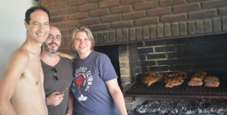

# El Asadito

Es un día precioso. Alrededor de la mesa, varios amigos entre los que se destacan Facu, Moni, Osky y Vero están dispuestos a compartir un asado entre amigos. Te pedimos que ayudes a modelar esta situación a través del paradigma OO.

## Punto ​1) ¿Me pasás la sal? - 3 puntos
Cada persona sabe su posición y qué elementos cerca tiene: sal, aceite, vinagre, aceto, oliva, cuchillo que corta bien, etc.
Queremos modelar que un comensal le pida a otro si le pasa una cosa.

Si la otra persona no tiene el elemento, la operaclassción no puede realizarse.

Lo que ocurre depende del criterio de cada persona tiene:
- algunos son sordos, le pasan el primer elemento que tienen a mano
- otros le pasan todos los elementos, “así me dejás comer tranquilo”
- otros le piden que cambien la posición en la mesa, “así de paso charlo con otras personas” (ambos intercambian posiciones, A debe ir a la posición de B y viceversa)
- y finalmente están las personas que le pasan el bendito elemento al otro comensal

Nos interesa que se puedan agregar nuevos criterios a futuro y que sea posible que una persona cambie de criterio dinámicamente (que pase de darle todos los elementos a sordo, por ejemplo). Cuando una persona le pasa un elemento a otro éste (el elemento) deja de estar cerca del comensal original para pasar a estar cerca del comensal que pidió el elemento.

## Punto 2) A comerrrrrrr - 4 puntos
Cada tanto se pasa una bandeja con una comida, que te dice cuántas calorías tiene y si es carne, por ejemplo: “Pechito de cerdo”, sí es carne e insume 270 calorías. Cada persona decide si quiere comer, en caso afirmativo registra lo que come. La decisión de comer o no depende de cómo elige la comida, que puede ser
- vegetariano: solo come lo que no sea carne
- dietético: come lo que insuma menos de 500 calorías, queremos poder configurarlo para todos los que elijan esta estrategia en base a lo que recomiende la OMS (Organización Mundial de la Salud)
- alternado: acepta y rechaza alternativamente cada comida
- una combinación de condiciones, donde todas deben cumplirse para aceptar la comida
  
Queremos que cada comensal pueda cambiar su criterio en cualquier momento y queremos que sea fácil incorporar nuevos criterios de elección de comida, así como evitar repetir la misma idea una y otra vez.

## Punto 3) Pipón - 2 puntos
Queremos saber si un comensal está pipón, esto ocurre si alguna de las comidas que ingirió es pesada (insume más de 500 calorias).

## Punto 4) ¡Qué bien la estoy pasando! - 3 puntos
Queremos saber si un comensal la está pasando bien en el asado, esto ocurre en general si esa persona comió algo y
- Osky no pone objeciones, siempre la pasa bien
- Moni si se sentó en la mesa en la posición 1@1
- Facu si comió carne
- Vero si no tiene más de 3 elementos cerca

## Punto 5) En teoría... - 2 puntos
indicar un lugar donde utilizó
- polimorfismo
- herencia
- composición
Justificar por qué y qué ventajas le dio.

