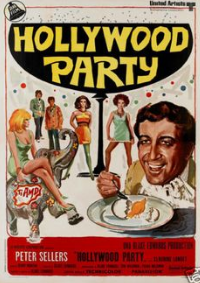

# Fiesta - Noviembre 2017
## Contenido a evaluar
- Composición / Correcta delegación
- Polimorfismo
- Herencia / Redefinición
- Template method o correcto uso de super 
- Composite / Strategy
- Diferenciar clases e instancias
- Manejo de errores

## Enunciado
Un amigo nuestro nos pidió que generemos una aplicación para ayudarlo en la organización de fiestas de disfraces.

Todo comienza cuando se celebra una fiesta, que ocurre en un lugar (ej: casa de Tina), una fecha, y hay una serie de invitados. Cada invitado asiste con un disfraz, aunque en cualquier momento puede cambiarlo por otro. Todos los disfraces tienen un nombre: “Media naranja”, “Político de turno”, etc. y sabemos la fecha en la que fue confeccionado.

### Puntuación de un disfraz
Queremos saber cuántos puntos tiene un disfraz, sabiendo que puede ser una combinación de las siguientes características:
- **graciosos**: está determinado por el nivel de gracia que tiene el disfraz (va de 1 a 10) y lo multiplican por 3 si el que lo lleva tiene más de 50 años. 
- **tobaras**: sabemos qué día lo compraron, un disfraz comprado 2 ó más días antes del día de la fiesta vale 5 puntos, o 3 en caso contrario.
- **caretas**: la careta simula un personaje real, y el valor es el que tiene dicho personaje (por ejemplo, el de Mickey Mouse vale 8, mientras que el de Oso Carolina vale 6),
- **sexies**: los disfraces sexies valen 15 puntos si la persona es sexy (ver más adelante), o 2 por el intento.

Como dijimos antes es posible que un disfraz sea sexy, tobara y careta, solo sexy, sexy y tobara, no tener ninguna característica, ser gracioso, etc. (es una combinación).

### Personalidades (simples y múltiples)
Una persona es sexy dependiendo de su personalidad:
- las personas alegres no son sexies
- las personas taciturnas son sexies si tienen menos de 30 años
- hay personas que tienen personalidad cambiante, a veces son alegres y a veces taciturnas

Modelar los tres tipos posibles de personalidad.

## Satisfecho o le devolvemos su traje
Todas las personas suelen estar conformes con un traje mayor a 10 puntos, y...
- ...los caprichosos quieren además que su traje tenga un nombre que tenga una cantidad par de letras
- ...los pretenciosos quieren que el traje esté hecho hace menos de 30 días
- ...los numerólogos quieren que el traje no sólo sea mayor a 10 puntos sino también que el puntaje sea exactamente una cifra que ellos determinan (por ejemplo: 15, pero ese número puede variar).
	
Según nuestro amigo “las personas no cambian”, así que no le interesa que una persona caprichosa pueda luego ser pretenciosa.

### Requerimientos
1. Determinar el puntaje de un disfraz.
   
2. Saber si una fiesta es un bodrio, esto ocurre cuando todos los asistentes están disconformes con su disfraz.

3. Saber cuál es el mejor disfraz de la fiesta (el que más puntos tiene).

4. Dada una fiesta y dos asistentes, queremos saber si pueden intercambiar  trajes: esto se da si 
   1. ambos están en la fiesta
   2. alguno de los dos está disconforme con su traje
   3. y cambiando el traje los dos pasan a estar conformes

5. Queremos agregar un asistente a una fiesta. Para eso debe cumplirse:
   1. el asistente debe tener un disfraz
   2. el asistente no debe estar ya cargado

6. Además queremos definir una “fiesta inolvidable”, una fiesta específica única e irrepetible que considera además que todo asistente
   1. debe ser sexy
   2. y debe estar conforme con su disfraz

